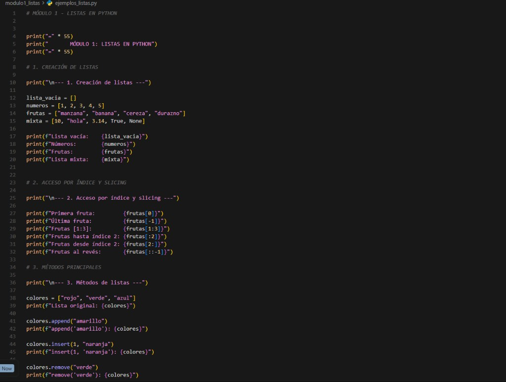
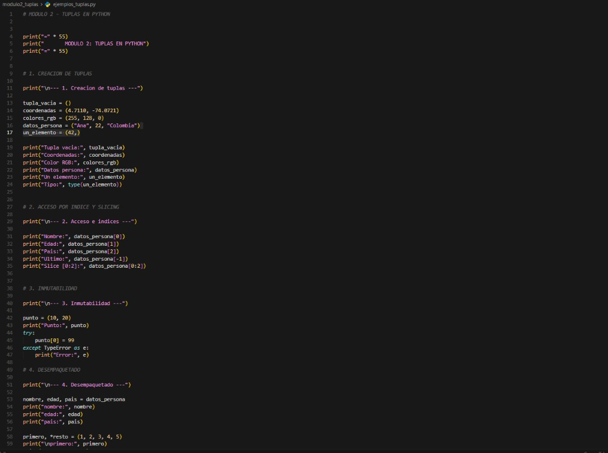
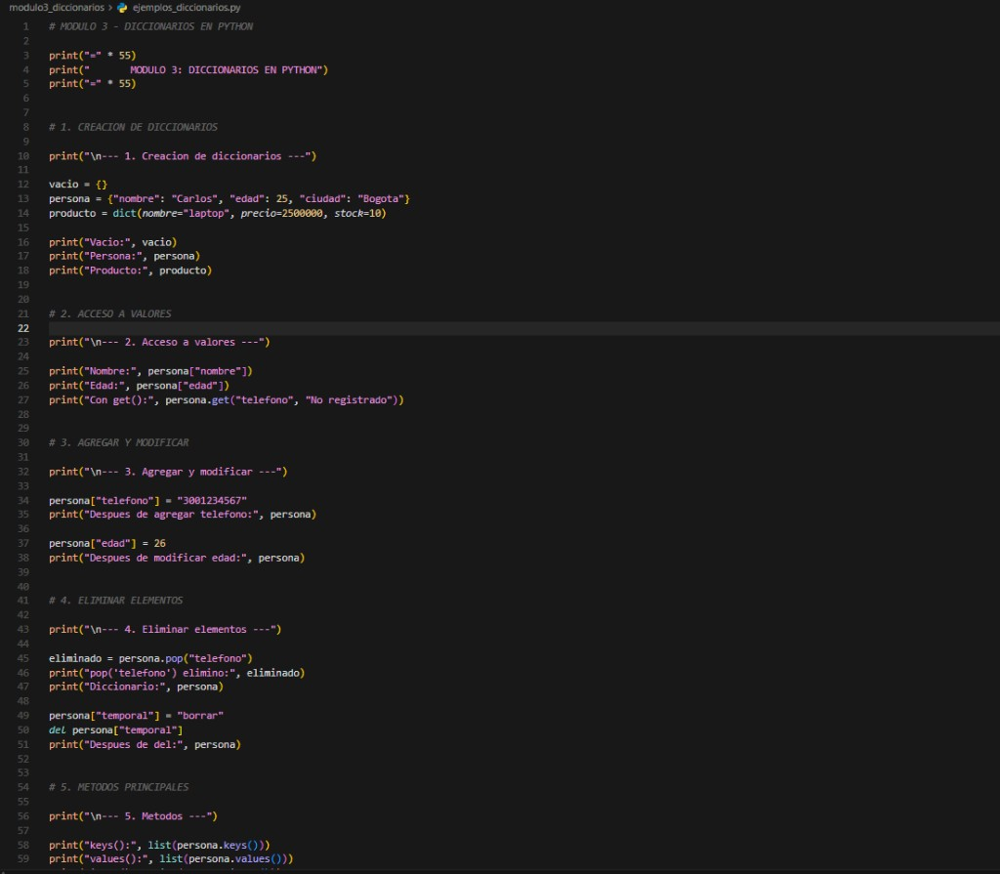
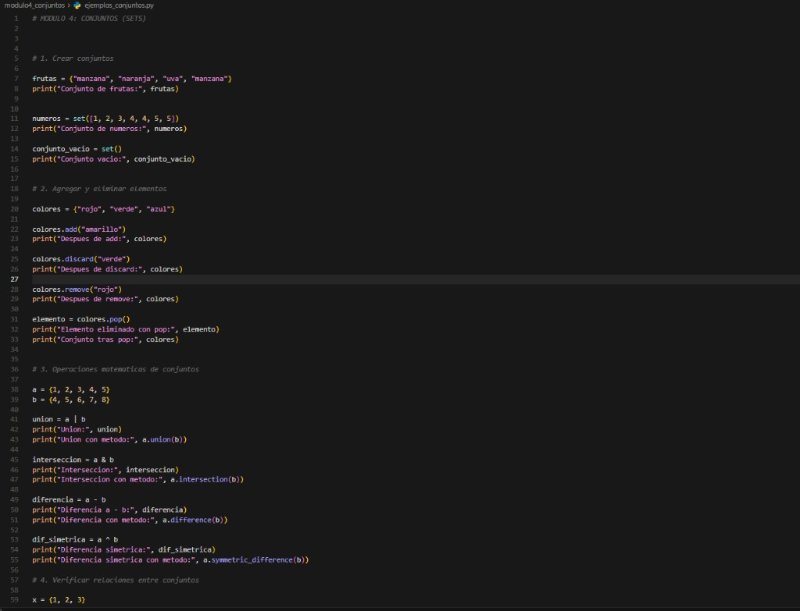
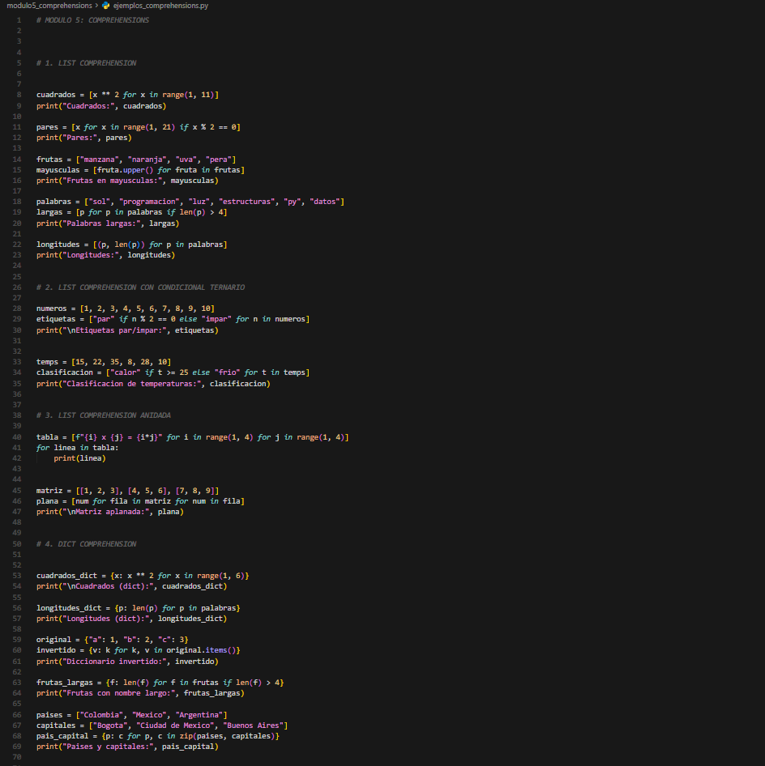
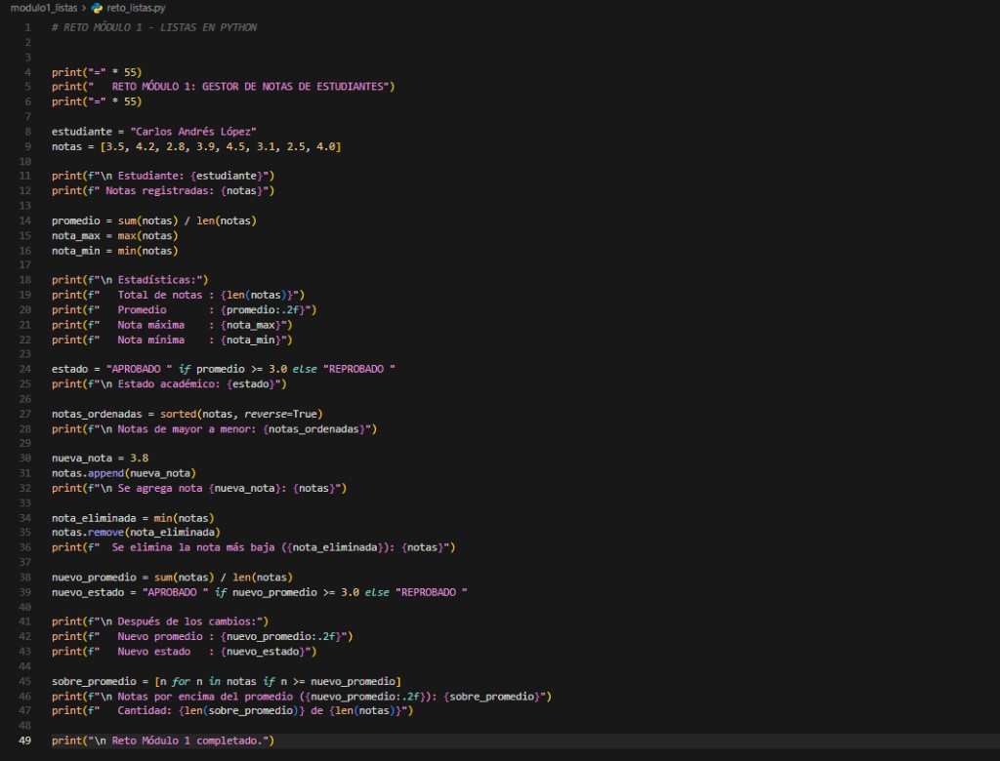
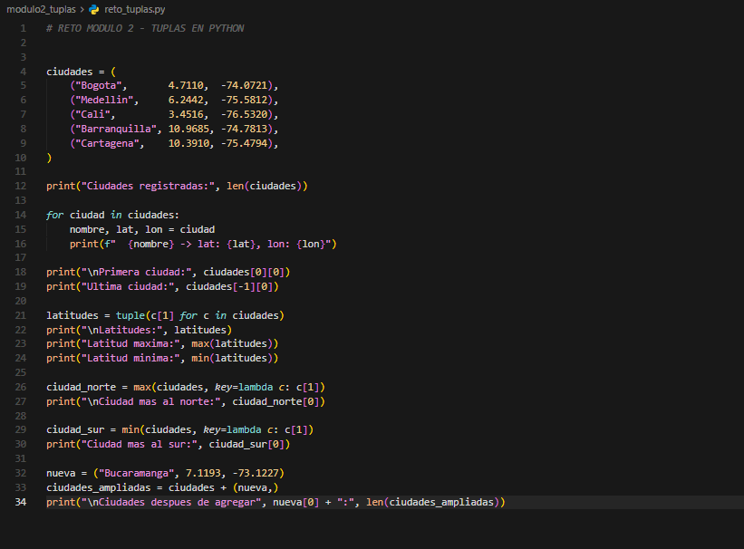
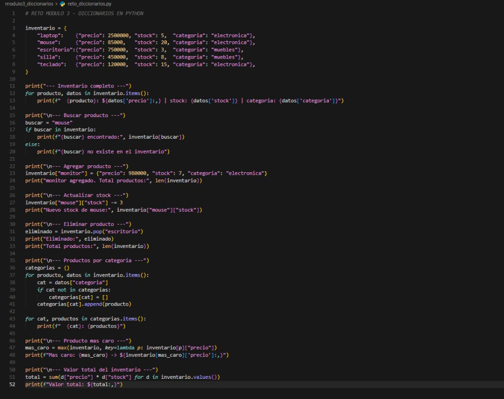
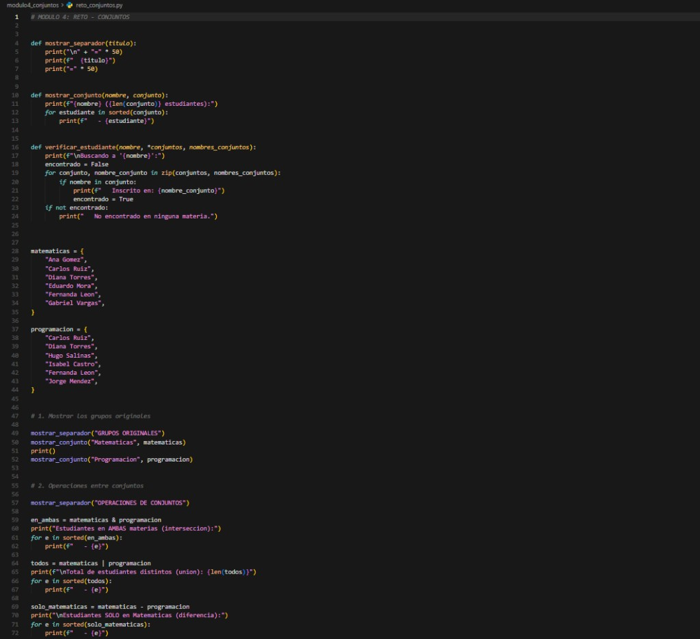
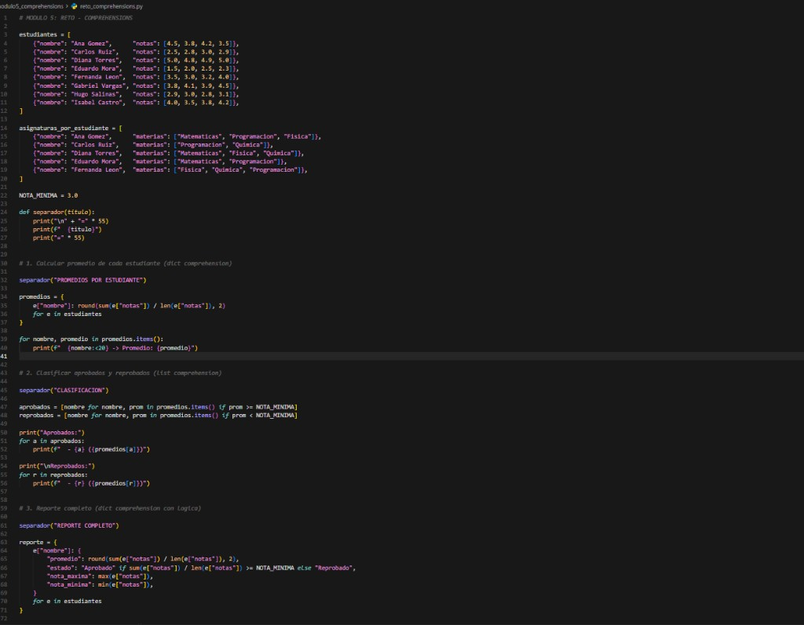

# GA1 220501093-04 AA1 EV03  
## Fundamentos de Python: Estructuras de Datos en Python

Proyecto individual desarrollado como evidencia de aprendizaje del curso **Estructuras de Datos en Python**.  
En este repositorio se replican ejemplos por modulo y se resuelven los retos propuestos para:

- Listas
- Tuplas
- Diccionarios
- Conjuntos
- Comprehensions

---

## 1) Descripcion del proyecto

Este proyecto organiza y aplica los conceptos fundamentales de estructuras de datos en Python mediante ejercicios practicos por modulo.  
Cada carpeta contiene:

- Un archivo de ejemplos (`ejemplos_*.py`) para practicar sintaxis y operaciones.
- Un archivo de reto (`reto_*.py`) con una situacion aplicada.

El objetivo fue comprender el uso correcto de cada estructura y su utilidad para resolver problemas reales de forma ordenada y eficiente.

---

## 2) Estructura del proyecto

```text
python_estructuras_datos/
│── modulo1_listas/
│   ├── ejemplos_listas.py
│   └── reto_listas.py
│── modulo2_tuplas/
│   ├── ejemplos_tuplas.py
│   └── reto_tuplas.py
│── modulo3_diccionarios/
│   ├── ejemplos_diccionarios.py
│   └── reto_diccionarios.py
│── modulo4_conjuntos/
│   ├── ejemplos_conjuntos.py
│   └── reto_conjuntos.py
│── modulo5_comprehensions/
│   ├── ejemplos_comprehensions.py
│   └── reto_comprehensions.py
│── images/
└── README.md
```

---

## 3) Temas aprendidos

### Modulo 1 - Listas
- Creacion y modificacion de listas.
- Uso de metodos como `append()`, `remove()`, `sorted()`.
- Calculo de estadisticas con `sum()`, `len()`, `max()`, `min()`.

### Modulo 2 - Tuplas
- Uso de tuplas como estructura inmutable.
- Desempaquetado de valores.
- Manipulacion de colecciones de datos geograficos.

### Modulo 3 - Diccionarios
- Almacenamiento de datos clave-valor.
- Actualizacion, eliminacion y consulta de elementos.
- Modelado de un inventario con diccionarios anidados.

### Modulo 4 - Conjuntos
- Operaciones entre conjuntos: union, interseccion, diferencia y diferencia simetrica.
- Validacion de pertenencia y uso de `isdisjoint()`.
- Aplicacion en gestion de grupos de estudiantes.

### Modulo 5 - Comprehensions
- `list comprehension`, `dict comprehension` y `set comprehension`.
- Uso de expresiones generadoras para estadisticas.
- Construccion de reportes y clasificacion automatica de datos.

---

## 4) Evidencia de retos resueltos

### Reto Modulo 1: Listas
Se desarrollo un gestor de notas que:
- calcula promedio, nota maxima y minima;
- determina estado academico del estudiante;
- agrega y elimina notas para recalcular resultados.

### Reto Modulo 2: Tuplas
Se construyo un registro de ciudades con coordenadas que permite:
- recorrer y mostrar datos por ciudad;
- obtener extremos geograficos (norte/sur);
- ampliar la coleccion manteniendo estructura tipo tupla.

### Reto Modulo 3: Diccionarios
Se implemento un inventario de productos para:
- buscar, agregar, actualizar y eliminar productos;
- agrupar por categoria;
- calcular producto mas costoso y valor total del inventario.

### Reto Modulo 4: Conjuntos
Se gestionaron estudiantes en dos materias para:
- identificar estudiantes comunes y exclusivos;
- verificar inscripciones por nombre;
- actualizar grupos y generar estadisticas finales.

### Reto Modulo 5: Comprehensions
Se realizo analisis academico usando comprehensions para:
- calcular promedios por estudiante;
- clasificar aprobados y reprobados;
- generar reporte completo y estadisticas generales del curso.

---

## 5) Capturas de ejecucion

> Guardar las imagenes en la carpeta `images/` y luego actualizar los nombres si cambian.

### Ejemplos por modulo
- 
- 
- 
- 
- 

### Retos por modulo
- 
- 
- 
- 
- 

---

## 6) Requisitos para ejecutar

- Python 3.x instalado.
- Editor de codigo (VS Code, PyCharm o similar).

Ejecutar desde terminal en la carpeta del proyecto:

```bash
python modulo1_listas/ejemplos_listas.py
python modulo1_listas/reto_listas.py
python modulo2_tuplas/ejemplos_tuplas.py
python modulo2_tuplas/reto_tuplas.py
python modulo3_diccionarios/ejemplos_diccionarios.py
python modulo3_diccionarios/reto_diccionarios.py
python modulo4_conjuntos/ejemplos_conjuntos.py
python modulo4_conjuntos/reto_conjuntos.py
python modulo5_comprehensions/ejemplos_comprehensions.py
python modulo5_comprehensions/reto_comprehensions.py
```

---

## 7) Reflexion personal del aprendizaje

Durante el desarrollo de esta actividad fortalezi mi logica de programacion y comprendi la diferencia entre cada estructura de datos en Python.  
Aprendi a seleccionar la estructura mas adecuada segun el tipo de problema, a organizar mejor la informacion y a escribir codigo mas claro y reutilizable.

Tambien identifique que las comprehensions y las operaciones entre conjuntos permiten resolver tareas de analisis de datos de forma mas corta y eficiente, lo que mejora la productividad al programar.

---

## 8) Autor

Aprendiz: **[Tu nombre completo]**  
Ficha: **[Tu ficha]**  
Programa: **Analisis y Desarrollo de Software (SENA)**
